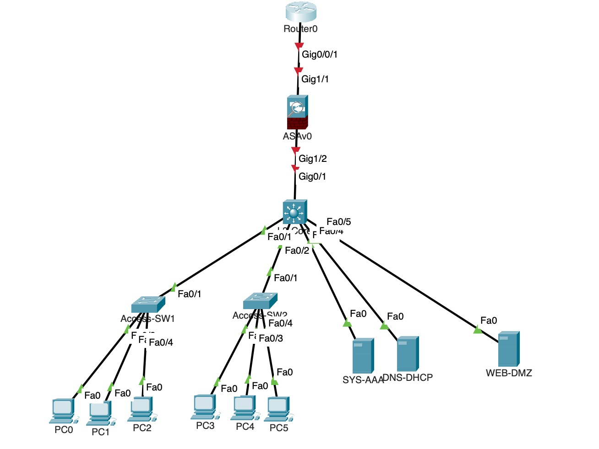
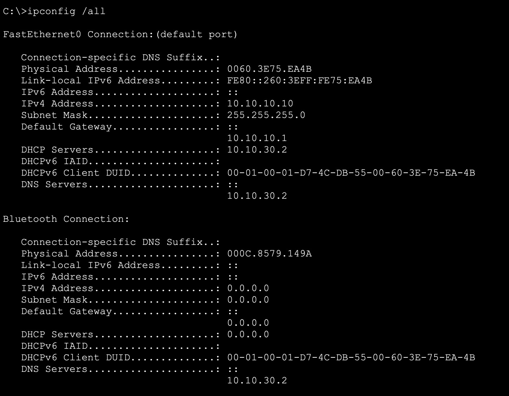
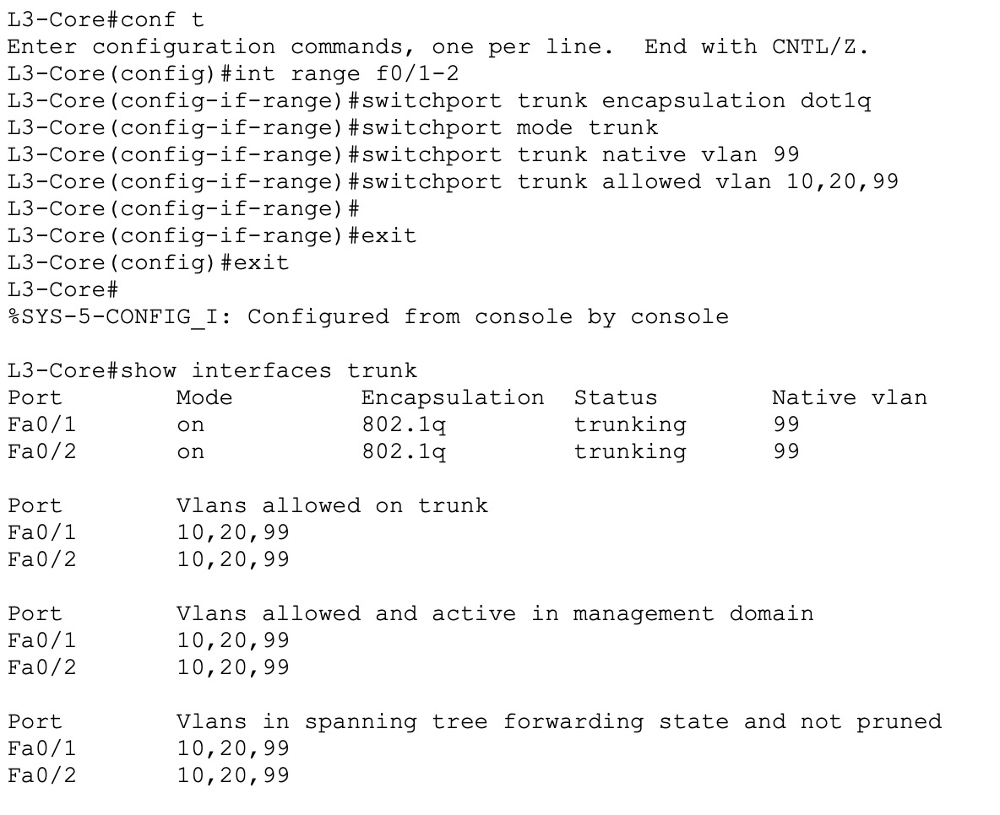
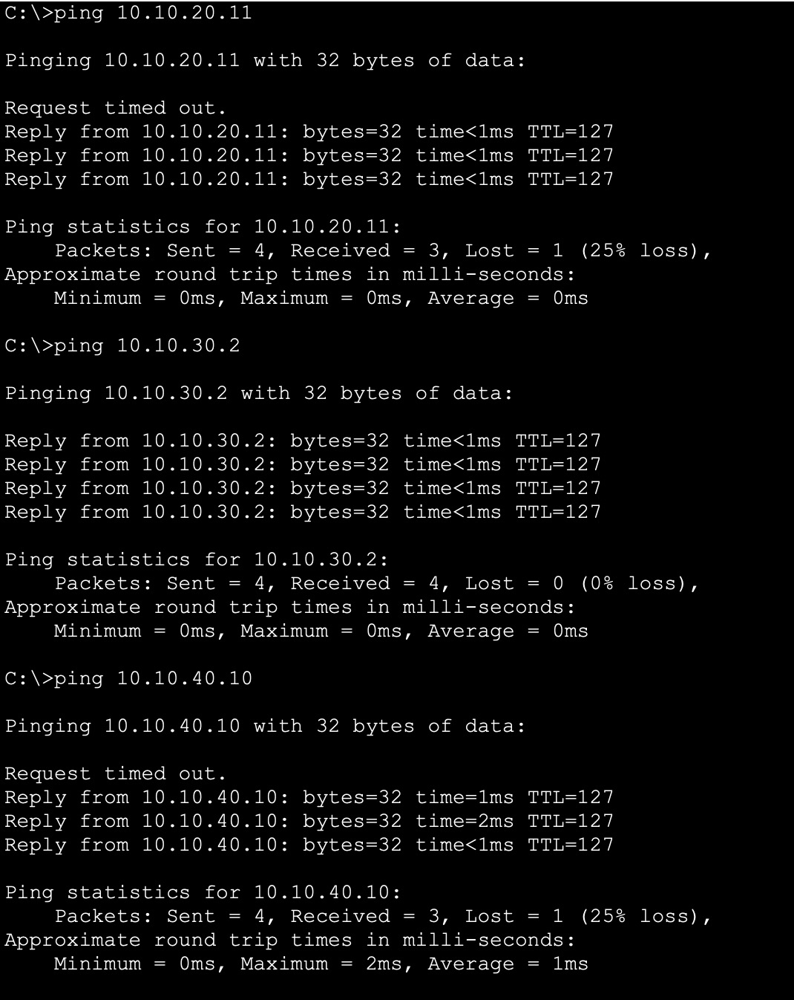
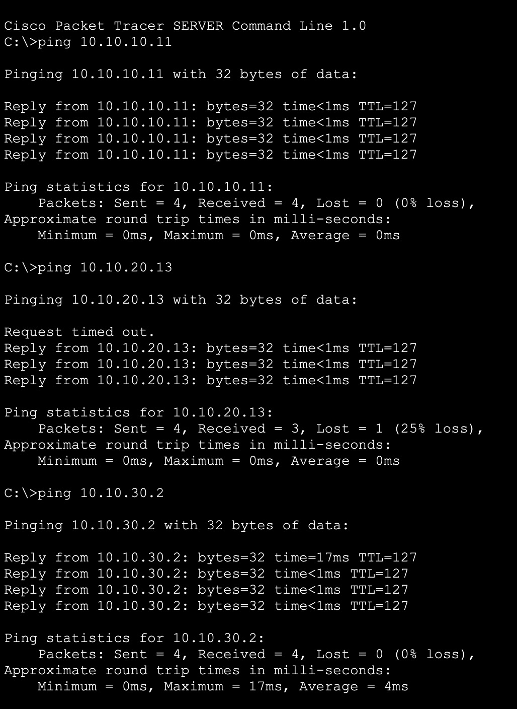

# Phase 1 — Segmented Topology & VLAN Design

## Project Overview

This phase establishes a fully segmented, routed, DHCP-enabled network as the foundation for
the rest of the capstone. Four VLANs separate management, end-user, server, and DMZ traffic,
with inter-VLAN routing handled by a Layer 3 core switch. At this stage, no security
restrictions are applied between VLANs — that's deliberate. Phase 1's goal is to prove the
network *works* end to end; Phase 2 is where it gets *secured*. The full "everything can reach
everything" baseline captured here becomes the "before" half of the strongest evidence in the
whole project — the Phase 1 vs. Phase 2 ping matrix comparison.

## Topology

```
                                   [ISP Cloud / WAN]
                                          |
                                     [ Router0 ]  (edge)
                                          |
                                     [ ASAv0 ]     (perimeter FW — configured Phase 2)
                                          |
                                 Gi0/1 ---+--- trunk
                                          |
                                  [ L3-Core ]  (multilayer switch)
                          /         |          |            \
                     Fa0/1       Fa0/2      Fa0/3-5        (direct)
                       |            |          |              |
                 [Access-SW1]  [Access-SW2]  SYS-AAA /      WEB-DMZ
                                              DNS-DHCP     (public-facing)
                   /    \          /    \    (VLAN 30)      (VLAN 40)
              VLAN10  VLAN20   VLAN10  VLAN20
              (Mgmt)  (Users)  (Mgmt)  (Users)
```

**Device inventory:** 1 edge router (`Router0`), 1 perimeter firewall (`ASAv0`, cabled but not
yet configured), 1 multilayer switch (`L3-Core`), 2 access switches (`Access-SW1`,
`Access-SW2`), 3 servers (`SYS-AAA`, `DNS-DHCP`, `WEB-DMZ`), and 6 end-user PCs — 2 in MGMT,
4 in USERS, split across the two access switches.



## VLAN & Addressing Table

Base block: `10.10.0.0/16`, subnetted as `/24`s per VLAN — chosen deliberately to demonstrate
route summarization, a CCNA topic that's easy to show off with a clean addressing scheme like
this one.

| VLAN ID | Name | Subnet | Gateway (SVI) | Purpose |
|---|---|---|---|---|
| 10 | MGMT | 10.10.10.0/24 | 10.10.10.1 | Switch/device management — 2 PCs, DHCP-assigned |
| 20 | USERS | 10.10.20.0/24 | 10.10.20.1 | End-user PCs — 4 PCs, DHCP-assigned |
| 30 | SERVERS | 10.10.30.0/24 | 10.10.30.1 | Internal servers — static IPs |
| 40 | DMZ | 10.10.40.0/24 | 10.10.40.1 | Public-facing web server — static IP |
| 99 | NATIVE (unused) | 10.10.99.0/24 | (unused) | Hardening — native VLAN never assigned to hosts |

**Static addressing (servers):**

| Host | IP | Notes |
|---|---|---|
| DNS-DHCP | 10.10.30.2 | Serves DNS + DHCP for VLANs 10/20 |
| SYS-AAA | 10.10.30.3 | Syslog target (used starting Phase 3) |
| WEB-DMZ | 10.10.40.10 | DNS set to `8.8.8.8`, not internal — see design decisions below |

**DHCP-assigned addressing (end-user PCs):** MGMT PCs received 10.10.10.10 and 10.10.10.11;
USERS PCs received 10.10.20.10 through 10.10.20.13 — all pulled dynamically from the pools
below, not manually configured, which is itself part of the validation evidence.

**DHCP pools (configured on DNS-DHCP):**

| Pool Name | Network | Gateway | DNS Server | Start Address |
|---|---|---|---|---|
| MGMT_POOL | 10.10.10.0/24 | 10.10.10.1 | 10.10.30.2 | 10.10.10.10 |
| USERS_POOL | 10.10.20.0/24 | 10.10.20.1 | 10.10.30.2 | 10.10.20.10 |

DMZ and Servers VLANs use static IPs only — standard practice for server-tier infrastructure,
where a fixed, predictable address matters more than convenience.



## Design Decisions

**Native VLAN hardening.** The default native VLAN (1) is a documented attack surface for VLAN
hopping via double-tagging. Every trunk port in this topology — L3-Core ↔ Access-SW1,
L3-Core ↔ Access-SW2 — has its native VLAN moved to 99, an ID with zero hosts assigned to it
anywhere in the design. VLAN 1 is also explicitly excluded from each trunk's allowed-VLAN list,
closing a related gap: VLAN 1 carries CDP/VTP/DTP/STP by default and is rarely pruned, making
it a common target.



**Port security mode: `restrict`, not `shutdown`.** Access ports connecting end-user PCs use
`switchport port-security violation restrict` rather than the more aggressive `shutdown` mode.
`restrict` drops unauthorized traffic and logs the violation (feeding Phase 3's syslog
pipeline) without taking the port itself offline. `shutdown` would err-disable the port
entirely, requiring manual re-enablement — a poor default for a segment with real end users
where a violation might just be someone plugging in a second personal device.

**DHCP relay via `ip helper-address`.** Since DNS-DHCP lives in VLAN 30 but DHCP clients are in
VLAN 10 and 20, each relevant SVI on L3-Core carries an `ip helper-address 10.10.30.2` — without
it, DHCP broadcast traffic from VLAN 10/20 clients would never reach the server, since routers/
L3 switches don't forward broadcasts across VLAN boundaries by default.

**WEB-DMZ's DNS points externally (8.8.8.8), not internally.** Every other host in the design
resolves DNS through the internal DNS-DHCP server (10.10.30.2). WEB-DMZ is the one exception —
a deliberate choice reflecting the DMZ's isolated role: a public-facing host shouldn't depend on
or be able to reach internal services, even for something as routine as name resolution. This
becomes more consequential in Phase 2, once ACLs formally deny DMZ-to-SERVERS traffic — at that
point, WEB-DMZ pointing to internal DNS wouldn't even work.

**Trunk encapsulation explicitly set to 802.1Q.** The simulated multilayer switch used for
L3-Core supports both legacy ISL and modern 802.1Q trunking encapsulation, defaulting to
`auto`. IOS refuses to enable trunk mode until the encapsulation is explicitly chosen
(`switchport trunk encapsulation dot1q`) — a one-line command that's easy to think of as
redundant on 802.1Q-only hardware, but required here given the specific simulated model.

## Validation Evidence

Full ping matrix confirmed across all four VLANs — every host reachable from every other VLAN,
in both directions, with no restrictions applied. This is expected and correct for Phase 1;
Phase 2 is where several of these paths get deliberately denied.

| From \ To | MGMT | USERS | SERVERS | DMZ |
|---|---|---|---|---|
| MGMT | — | Allow | Allow | Allow |
| USERS | Allow | — | Allow | Allow |
| SERVERS | Allow | Allow | — | Allow |
| DMZ | Allow | Allow | Allow | — |





See `screenshots/phase1/` for the full supporting evidence set: VLAN/SVI/trunk configuration
and verification, port security confirmation on both access switches, DHCP pool configuration,
static IP confirmation on all three servers, and the remaining ping test results (USERS →
others, SERVERS → others) that complete the full mesh validation shown in the table above.