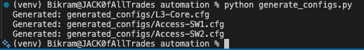
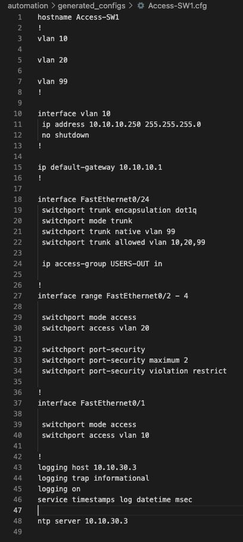
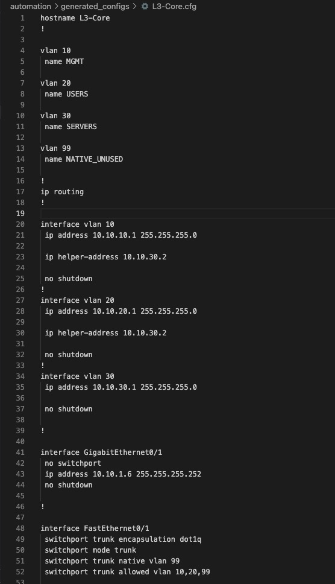
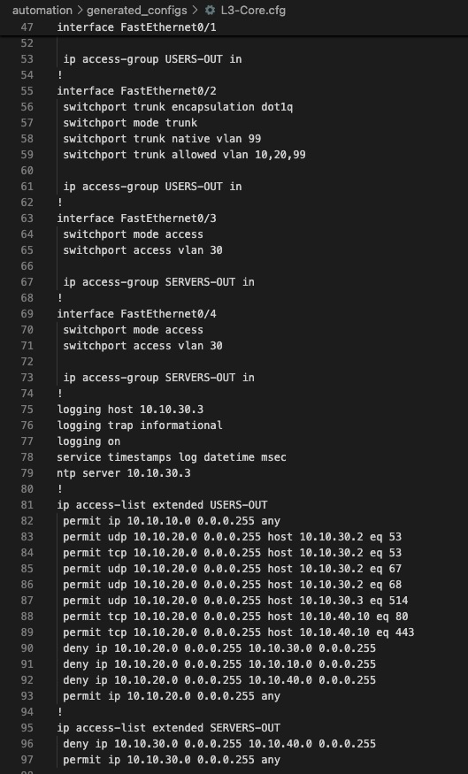

# Phase 4 — Config-as-Code Automation

## What this phase does

Instead of typing the same VLAN and ACL config into every device by hand, this phase puts
the whole design into one YAML file and uses a Python + Jinja2 script to generate the
actual CLI config for each device from it. Change something once in the YAML, regenerate,
and every device's config is in sync. This isn't pushed live to the devices — Packet
Tracer doesn't allow real SSH/API access to its simulated devices from a host machine — the
point here is proving the design can be maintained from a single source, not automating
the actual push.

## Scope: L3-Core and the two access switches only

ASAv0 and Router0 aren't templated. ASA config is different enough from IOS — different
NAT model, no VLANs, different way of binding ACLs — that building one templating system
for both would mean basically writing two separate systems for one firewall. Not worth it.
Router0's config is two interfaces and two routes — nothing repetitive enough to bother
automating. Both stay hand-maintained, and both are already fully documented in Phase 2/3.

## The source file: `network_inventory.yaml`

This isn't the generic example from the original build guide — it's built from what
actually got configured and tested. A few things worth calling out:

- **No VLAN 40 (DMZ) on L3-Core.** DMZ moved to its own interface on ASAv0 partway through
  Phase 2 (see that doc for why), so it doesn't belong in L3-Core's config anymore.
- **`USERS-OUT` has every fix found in Phase 3** — the MGMT permit that has to come first
  (MGMT traffic crosses the same trunk ports as USERS traffic and was getting silently
  blocked before this was added), the syslog permit to SYS-AAA, and catch-all rules scoped
  to the actual subnet instead of a blanket `any`.
- **`DMZ-OUT` is gone.** Superseded by the firewall handling DMZ isolation itself.
- **No `log` keyword anywhere.** Confirmed early on that this Packet Tracer build rejects
  it on ACL lines — generating config with it would just fail to apply, so it's left out
  of the schema entirely.
- **Access switches now include their management IP, gateway, and logging/NTP config** —
  none of that existed until Phase 3 forced the issue.
- **ACLs are attached to the actual physical ports**, not VLAN interfaces, matching what
  actually had to be done since SVI-applied ACLs didn't work reliably in this simulator.

## Templates and generator

Two templates — one for the L3 switch, one for access switches — plus a short script that
reads the YAML and renders each device's config into `generated_configs/`.

```
pip install jinja2 pyyaml
python generate_configs.py
```



## Checking the output

Read the generated files against the real, tested configs from Phase 2/3 rather than
running a formal diff tool.

**Access-SW1** — management IP, gateway, trunk uplink, port security, logging and NTP all
came out matching the real device:



**L3-Core** — VLANs, SVIs, and the routed link to ASAv0 on the first part, then the trunk
and access ports plus the full `USERS-OUT` ACL in the correct order on the second — MGMT
permit first, then the specific permits, then the denies, then the catch-all. That order
is exactly what made the real ACL work after all the Phase 3 debugging, so seeing it come
out right here is the actual proof the template logic is sound, not just similar-looking:





## What changes if you extend this later

Adding a VLAN, a device, or an ACL rule means editing the YAML file. Nothing else. That
also removes a whole category of mistake this project actually hit — the `SERVERS-OUT`
rule-ordering bug, the missing MGMT permit — since every device now renders from the same
reviewed list instead of being typed out separately by hand each time.

## Files

```
automation/
├── network_inventory.yaml
├── templates/
│   ├── l3_switch.j2
│   └── access_switch.j2
├── generate_configs.py
└── generated_configs/
    ├── L3-Core.cfg
    ├── Access-SW1.cfg
    └── Access-SW2.cfg
```