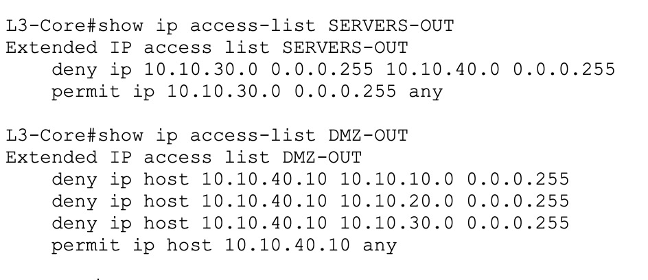
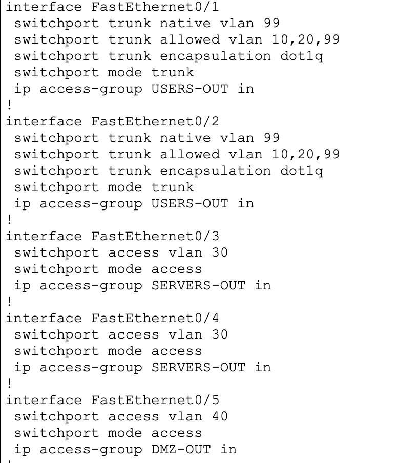

# Phase 2 — Perimeter Firewall & Least-Privilege Segmentation

## Project Overview

This phase adds a perimeter firewall (ASAv0) and internal segmentation ACLs on L3-Core,
converting Phase 1's fully-open network into a least-privilege design. The goal: only the
DMZ web server is reachable from outside, and every internal VLAN can reach only what it
legitimately needs — nothing more.

## Security Design

| Path | Rule | Why |
|---|---|---|
| Outside → DMZ (80/443 only) | Permit | Only the public web server is internet-reachable |
| Outside → anything else | Deny (implicit + explicit) | Nothing else should be reachable from outside |
| DMZ → MGMT / USERS / SERVERS | Deny | If the web server is compromised, it can't pivot inward |
| USERS → SERVERS | Restricted to DNS + DHCP only | No arbitrary access to internal servers |
| USERS → MGMT | Deny | End users have no legitimate reason to reach the admin VLAN |
| USERS → DMZ | Restricted to HTTP/HTTPS only | Same access a normal visitor would have, nothing broader |
| MGMT → everywhere | Permit | Admin subnet needs full reach to manage the environment |
| SERVERS → DMZ | Deny | Servers have no legitimate reason to initiate to DMZ |

**Three deliberate hardening gaps, identified and closed during the build** — the original
reference design only restricted DMZ→MGMT/SERVERS and USERS→SERVERS, leaving three implicit
holes through the catch-all permit:

- **DMZ → USERS** was originally left open. Closed, since a public-facing host has no
  legitimate reason to initiate connections to end-user PCs.
- **USERS → MGMT** was originally left open. Closed, since ordinary users have no legitimate
  reason to reach the management VLAN — the entire point of a separate MGMT VLAN is isolating
  administrative access.
- **USERS → DMZ** was originally unrestricted (full IP access). Scoped down to HTTP/HTTPS
  only, matching what a legitimate user actually needs from the public web server.

## ASAv0 — Perimeter Firewall

**Interfaces** (this PT build's simulated ASAv uses `Gig1/x` interface naming, not the `Gi0/x`
convention used elsewhere in the topology):
- `Gig1/1` — outside, security-level 0, `10.10.1.2/30`
- `Gig1/2` — inside, security-level 100, `10.10.1.5/30`

**Routing** — two static routes, both required:
```
route inside 10.10.0.0 255.255.0.0 10.10.1.6
route outside 0.0.0.0 0.0.0.0 10.10.1.1
```
The outside default route was a real gap in the original design, caught through testing —
without it, inbound connection replies were silently dropped after reaching the DMZ server,
since ASAv0 had no path back out to the client. This is the standard pattern for an ASA's
outside interface: point toward whatever's "further out" (a real ISP gateway in production;
Router0 standing in for it here).


**NAT:**
```
object network INSIDE-NET
 subnet 10.10.0.0 255.255.0.0
 nat (inside,outside) dynamic interface

object network DMZ-WEB
 host 10.10.40.10
 nat (inside,outside) static 203.0.113.10
```
Internal hosts reach outward via dynamic PAT off the outside interface. WEB-DMZ is
statically NAT'd to a single simulated public IP.

**Perimeter ACL** (`OUTSIDE-IN`):
```
access-list OUTSIDE-IN extended permit tcp any host 203.0.113.10 eq 80
access-list OUTSIDE-IN extended permit tcp any host 203.0.113.10 eq 443
access-list OUTSIDE-IN extended deny ip any any

access-group OUTSIDE-IN in interface outside
```

**Router0 companion route** (required for the static NAT to be reachable at all — something
upstream of ASAv0 has to know how to route to the simulated public block):
```
ip route 203.0.113.0 255.255.255.0 10.10.1.2
```

## Internal Segmentation — L3-Core ACLs

```
ip access-list extended DMZ-OUT
 deny ip 10.10.40.0 0.0.0.255 10.10.10.0 0.0.0.255
 deny ip 10.10.40.0 0.0.0.255 10.10.20.0 0.0.0.255
 deny ip 10.10.40.0 0.0.0.255 10.10.30.0 0.0.0.255
 permit ip 10.10.40.0 0.0.0.255 any

ip access-list extended USERS-OUT
 permit udp 10.10.20.0 0.0.0.255 host 10.10.30.2 eq 53
 permit tcp 10.10.20.0 0.0.0.255 host 10.10.30.2 eq 53
 permit udp 10.10.20.0 0.0.0.255 host 10.10.30.2 eq 67
 permit udp 10.10.20.0 0.0.0.255 host 10.10.30.2 eq 68
 permit tcp 10.10.20.0 0.0.0.255 host 10.10.40.10 eq 80
 permit tcp 10.10.20.0 0.0.0.255 host 10.10.40.10 eq 443
 deny ip 10.10.20.0 0.0.0.255 10.10.30.0 0.0.0.255
 deny ip 10.10.20.0 0.0.0.255 10.10.10.0 0.0.0.255
 deny ip 10.10.20.0 0.0.0.255 10.10.40.0 0.0.0.255
 permit ip 10.10.20.0 0.0.0.255 any

ip access-list extended SERVERS-OUT
 deny ip 10.10.30.0 0.0.0.255 10.10.40.0 0.0.0.255
 permit ip 10.10.30.0 0.0.0.255 any
```

Applied to the physical ports where each VLAN's traffic actually enters L3-Core (see
"SVI ACL limitation" below for why physical ports, not SVIs):

```
interface fastEthernet 0/1
 ip access-group USERS-OUT in
interface fastEthernet 0/2
 ip access-group USERS-OUT in
interface fastEthernet 0/3
 ip access-group SERVERS-OUT in
interface fastEthernet 0/4
 ip access-group SERVERS-OUT in
interface fastEthernet 0/5
 ip access-group DMZ-OUT in
```

**Catch-all lines restricted to the source subnet** (`permit ip 10.10.X.0 0.0.0.255 any`
rather than `permit ip any any`) — a deliberate hardening choice beyond the original
reference design, so the ACL only ever permits traffic genuinely originating from the VLAN
it claims to be from, rather than trusting any source address that happens to arrive on
that port.

## Packet Tracer-Specific Constraints Encountered

Several commands and features that work as documented on real Cisco hardware behaved
differently in this simulator. Each is noted here rather than treated as a design error,
since the underlying design is correct — these are tooling limitations, confirmed through
testing rather than assumed:

- **`object-group` service definitions can be created but can't be referenced inside
  `access-list` lines.** Confirmed via `show run object` (the object-group existed
  correctly) while the ACL line referencing it was rejected. Worked around by writing
  individual port rules against the `object` (single-host) reference instead.
- **The `log` keyword is rejected on `access-list` lines**, on both ASAv0 (ASA OS) and
  L3-Core (IOS) in this build. All ACLs here omit `log`; Phase 3's syslog evidence relies on
  general `logging trap` configuration rather than per-ACL-line logging as a result.
- **`ip access-group` does not reliably enforce when applied to SVIs.** Config accepted with
  no error, but `show ip interface vlan X` consistently showed "Inbound access list is not
  set" even after applying it. Worked around by applying ACLs to the physical access/trunk
  ports where each VLAN's traffic actually enters L3-Core instead — arguably a more literal
  implementation of the CCNA principle of filtering as close to the source as possible.
- **`ip access-group` on plain access-mode ports does not enforce, while the same command on
  trunk-encapsulated ports does.** Confirmed via controlled before/after hit-counter testing:
  `USERS-OUT` on the trunk ports (Fa0/1, Fa0/2) shows real hit counts and generates correct
  ICMP unreachable replies for denied traffic; `SERVERS-OUT` (Fa0/3, Fa0/4) and `DMZ-OUT`
  (Fa0/5), both plain access ports, show zero hit-count movement despite identical matching
  traffic. `vlan access-map` was also tested as an alternative L2 filtering mechanism and
  found entirely unsupported in this PT version. This appears to be a specific, reproducible
  simulator limitation rather than a configuration error. **DMZ-OUT and SERVERS-OUT remain
  correctly designed and applied as evidence of intended least-privilege enforcement**, with
  functional enforcement demonstrated on USERS-OUT and at the ASAv0 perimeter.
  
  

- **ASA's automatic NAT-aware ACL matching (referencing real addresses against translated
  traffic, standard on ASA 8.3+) did not work correctly.** The perimeter ACL originally
  referenced `object DMZ-WEB` (its real internal address); despite matching traffic, hit
  counts stayed at 0. Rewriting the ACL to reference the translated public address
  (`host 203.0.113.10`) directly resolved it — confirmed via hit-counter increments after
  the fix.
- **ASA-specific syntax differences**: `access-group` does not take an `extended` keyword;
  `clear configure access-list` is unsupported (use `no access-list <name> extended <exact
  line>` per line instead); `show ip route` doesn't exist on ASA (`show route`); `show
  access-list <name>` with a name argument is unsupported (bare `show access-list` only).

## Validation Evidence

**Perimeter test — outside PC to DMZ web server:**


Full NAT + ACL + routing chain confirmed working end to end: a simulated outside host
successfully connects to `203.0.113.10` on ports 80 and 443 (translated to WEB-DMZ's real
address `10.10.40.10`), while direct ICMP to the same address is denied by the perimeter
ACL — no unintended exposure beyond the two web ports.

**Internal segmentation test — USERS VLAN enforcement (trunk-port ACL, confirmed working):**


From a USERS PC: pings to SERVERS and MGMT correctly return "destination host unreachable"
(the ACL deny generating an ICMP unreachable reply, standard IOS behavior); `nslookup`
against the internal DNS server succeeds; `telnet` to the DMZ web server on port 80 connects
successfully. This single test demonstrates both the deny and permit sides of `USERS-OUT`
working correctly in the same pass.

**Internal ACL application — the working configuration:**



**Before/after ping matrix**, re-run from Phase 1's baseline (full mesh, everything allowed):

| From \ To | MGMT | USERS | SERVERS | DMZ |
|---|---|---|---|---|
| MGMT | — | Allow | Allow | Allow |
| USERS | **Deny** | — | **Deny (ping)** / Allow DNS+DHCP+web only | **Deny (ping)** / Allow HTTP+HTTPS only |
| SERVERS | Allow¹ | Allow¹ | — | Deny (design intent — not independently confirmed enforced, see constraints above) |
| DMZ | Allow (design intent — not independently confirmed enforced) | Allow (design intent — not independently confirmed enforced) | Allow (design intent — not independently confirmed enforced) | — |

¹ SERVERS→USERS/MGMT ping succeeds by design (SERVERS-OUT's catch-all permits it); the
return ICMP reply from USERS/MGMT back to SERVERS is denied by `USERS-OUT`/would be denied
by a MGMT equivalent — a deliberate, documented side effect of stateless ACL behavior (see
below), left unfixed since the traffic that actually matters (DNS/DHCP replies) is
unaffected.

Full supporting evidence, including the PT-quirk diagnostics referenced above (object-group
rejection, SVI limitation proof, zero-hit-count access port tests): see
`screenshots/phase2/`.

## Note on ACL Statelessness

Standard/extended Cisco ACLs are stateless — they evaluate every packet independently with
no memory of an existing session. As a result, `SERVERS-OUT`'s permissive catch-all lets
SERVERS-initiated traffic (e.g. a ping to a USERS PC) leave freely, but the corresponding
reply is itself a new packet sourced from USERS, destined to SERVERS — and `USERS-OUT`'s
deny rule catches it like any other unsolicited USERS→SERVERS traffic. This is left
unpatched rather than adding an explicit echo-reply permit, since the functional traffic
that actually matters (DNS queries and DHCP, which reply *from* SERVERS and are governed by
the permissive `SERVERS-OUT` rule) is unaffected — only diagnostic ICMP round-trips break.
This is a deliberate acceptance of an edge case in a stateless design, contrasted directly
with ASAv0's stateful inspection, which handles return traffic automatically without needing
a mirrored rule.
