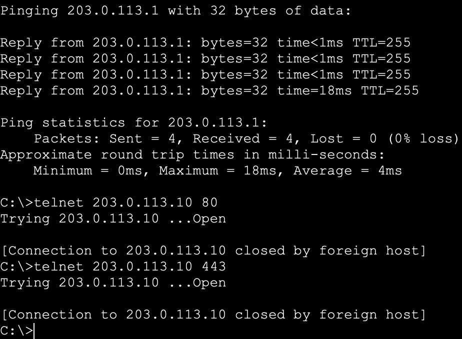
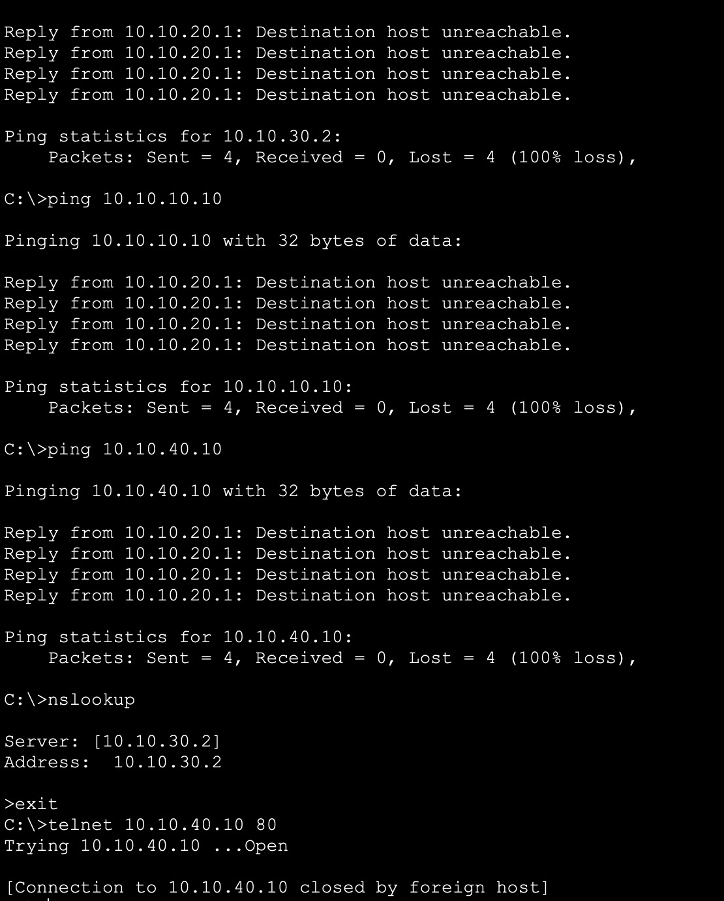
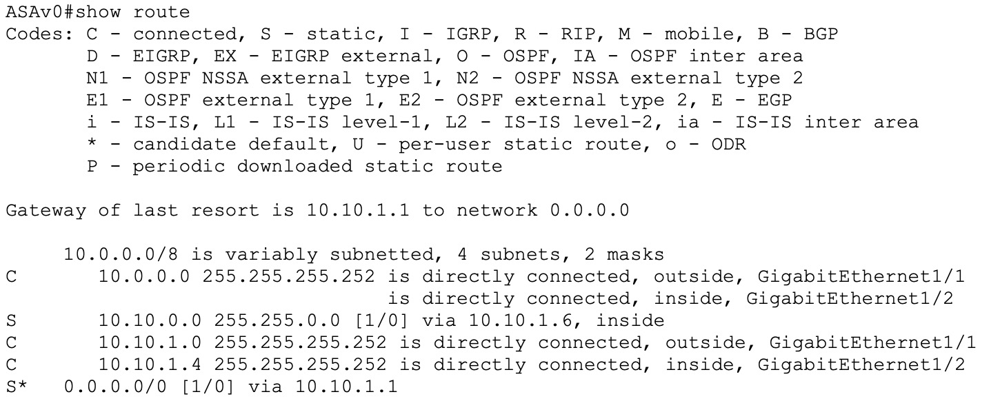

# Phase 2 — Perimeter Firewall & Least-Privilege Segmentation

## Project Overview

This phase adds a perimeter firewall (ASAv0) and internal segmentation ACLs on L3-Core,
converting Phase 1's fully-open network into a least-privilege design. The goal: only the
DMZ web server is reachable from outside, and every internal VLAN can reach only what it
legitimately needs — nothing more.

**Design note — DMZ as a dedicated firewall zone, not a VLAN behind the core switch.**
The initial build placed the DMZ web server on its own VLAN (40) behind L3-Core, with
isolation enforced by an ACL (`DMZ-OUT`) applied at the switch. That works, but it puts the
DMZ's isolation guarantee one hop away from the firewall, dependent on a correctly-written
and correctly-applied switch ACL rather than the firewall itself. The design was revised to
a proper **three-legged firewall**: DMZ now connects directly to its own interface on
ASAv0, with its own security level, so DMZ isolation is enforced structurally by the
firewall's security-level model — a stronger guarantee, and the more conventional
architecture for this kind of design.

## Security Design

| Path | Rule | Why |
|---|---|---|
| Outside → DMZ (80/443 only) | Permit | Only the public web server is internet-reachable |
| Outside → anything else | Deny (implicit + explicit) | Nothing else should be reachable from outside |
| DMZ → Inside (MGMT/USERS/SERVERS) | Deny (structural — ASA security-level default) | If the web server is compromised, it can't pivot inward |
| USERS → SERVERS | Restricted to DNS + DHCP only | No arbitrary access to internal servers |
| USERS → MGMT | Deny | End users have no legitimate reason to reach the admin VLAN |
| USERS → DMZ | Restricted to HTTP/HTTPS only | Same access a normal visitor would have, nothing broader |
| MGMT → everywhere | Permit | Admin subnet needs full reach to manage the environment |
| SERVERS → DMZ | Deny | Servers have no legitimate reason to initiate to DMZ |

**Deliberate hardening gaps identified and closed during the build** — beyond the original
reference design:

- **DMZ → everywhere inside** — originally only DMZ→MGMT/SERVERS were denied via ACL,
  leaving DMZ→USERS open. Now moot: the three-legged redesign denies DMZ→inside entirely,
  by default, at the firewall — no per-VLAN enumeration needed or possible to get wrong.
- **USERS → MGMT** was originally left open through the catch-all permit. Closed, since
  ordinary users have no legitimate reason to reach the management VLAN.
- **USERS → DMZ** was originally unrestricted (full IP access). Scoped down to HTTP/HTTPS
  only, matching what a legitimate user actually needs from the public web server.
- **USERS-OUT was silently blocking MGMT traffic.** `USERS-OUT` is applied on the trunk
  ports (Fa0/1, Fa0/2) which carry both VLAN 10 (MGMT) and VLAN 20 (USERS) — but every rule
  in it matched only `10.10.20.0/24` sources. MGMT-sourced traffic crossing those same
  physical ports fell into the ACL's implicit deny, silently contradicting the design's
  "MGMT unrestricted" intent. Found while configuring switch management addressing; fixed
  with an explicit `permit ip 10.10.10.0 0.0.0.255 any` placed first in the ACL.
- **Least-privilege ACLs were silently blocking the monitoring pipeline itself.** Locking
  `USERS-OUT` down to only DNS/DHCP/HTTP toward SERVERS/DMZ also blocked syslog (UDP 514)
  and NTP (UDP 123) traffic destined for the syslog server (SYS-AAA, `10.10.30.3`) —
  since nothing explicitly permitted it. Fixed by adding explicit permits for both ports,
  scoped to SYS-AAA specifically, in `USERS-OUT`. The same problem applied to Router0's
  management traffic against the perimeter ACL (see below).

## ASAv0 — Perimeter Firewall (Three-Legged Design)

**Interfaces** (this PT build's simulated ASAv uses `Gig1/x` interface naming, not `Gi0/x`):
- `Gig1/1` — outside, security-level 0, `10.10.1.2/30`
- `Gig1/2` — inside, security-level 100, `10.10.1.5/30`
- `Gig1/3` — dmz, security-level 50, `10.10.40.1/24` — **ASAv0 is now WEB-DMZ's default
  gateway**, not L3-Core

```
interface gigabitEthernet1/3
 nameif dmz
 security-level 50
 ip address 10.10.40.1 255.255.255.0
 no shutdown
```

WEB-DMZ's own IP config keeps its address (`10.10.40.10`) but its gateway changes to
`10.10.40.1`.

**Why security-level 50 matters, not just as a number:** ASA permits traffic from a higher
security level to a lower one automatically, and denies the reverse without an explicit
ACL permit. With DMZ at 50 (between outside=0 and inside=100):
- Inside (100) → DMZ (50): allowed by default (higher → lower security)
- DMZ (50) → Inside (100): **denied by default by ASA security-level policy** (lower →
  higher security) — no ACL required for this baseline denial, though an ACL applied to the
  DMZ interface could further restrict or selectively permit specific traffic if a future
  need arose (e.g. a DMZ host needing to reach one specific internal database port). This
  used to be L3-Core's `DMZ-OUT` ACL's job entirely; it's now a structural property of the
  firewall design instead, with ACLs available as an optional refinement layer on top.
- Outside (0) → DMZ (50): still requires the explicit `OUTSIDE-IN` permit for 80/443

**Routing** — two static routes for inside/outside; no separate route needed for DMZ,
since it's now directly connected to ASAv0:
```
route inside 10.10.0.0 255.255.0.0 10.10.1.6
route outside 0.0.0.0 0.0.0.0 10.10.1.1
```
The outside default route was a real gap caught through testing — without it, inbound
connection replies were silently dropped after reaching the DMZ server, since ASAv0 had no
path back out to the client.

**NAT** — the static NAT rule's zone pair changed to reflect DMZ's new interface:
```
object network INSIDE-NET
 subnet 10.10.0.0 255.255.0.0
 nat (inside,outside) dynamic interface

object network DMZ-WEB
 host 10.10.40.10
 nat (dmz,outside) static 203.0.113.10
```
(was `nat (inside,outside)` when DMZ lived behind L3-Core — changed to `dmz,outside` now
that the object sits on its own zone)

**Perimeter ACL** (`OUTSIDE-IN`) — unchanged by the redesign, since it was already written
against the translated public address rather than an object reference:
```
access-list OUTSIDE-IN extended permit tcp any host 203.0.113.10 eq 80
access-list OUTSIDE-IN extended permit tcp any host 203.0.113.10 eq 443
access-list OUTSIDE-IN extended permit udp host 10.10.1.1 host 10.10.30.3 eq 123
access-list OUTSIDE-IN extended permit udp host 10.10.1.1 host 10.10.30.3 eq 514
access-list OUTSIDE-IN extended deny ip any any

access-group OUTSIDE-IN in interface outside
```
(Written against the translated public address, not an `object` reference — this build's
ASAv did not correctly NAT-translate the object before ACL matching; confirmed via 0 hit
counts on the object-based version, fixed by using the host address directly.)

**The two `udp host 10.10.1.1` permits exist because Router0 sits on ASAv0's *outside*
interface** — architecturally, Router0 is "outside" the firewall, same as anything on the
internet, so its own management traffic (NTP/syslog requests to internal SYS-AAA) is
subject to the same perimeter ACL as any other outside-originated traffic. This is a
deliberate least-privilege scoping (permit only Router0's specific address, not `any`) —
not an oversight, and a good illustration that "edge device" traffic isn't implicitly
trusted just because it's part of your own topology. In a production design, an upstream
router in this position would typically represent the ISP/edge network, with the firewall
sitting between the untrusted WAN and the trusted internal zones; Router0 plays that role
here as the simulated upstream provider edge, rather than being an internal device
accidentally placed outside the firewall.

**UDP/ICMP inspection** — ASA performs state tracking differently across protocols: TCP has
built-in connection tracking via the handshake itself, while UDP and ICMP are connectionless
and require explicit `inspect` entries to maintain expected return-path behavior. Without
these, replies to self-initiated outbound ICMP/UDP traffic (e.g. NAT'd hosts pinging or
NTP-syncing outward) have no state entry to match against on the way back and get dropped.
**In this Packet Tracer build, only `inspect icmp` is an available policy-map option —
`inspect udp` does not exist as a configurable class in this simulated ASA image** (confirmed
via the policy-map configuration options directly). This matters concretely: ICMP-based
round trips through the firewall (e.g. DMZ pinging an outside host) can be fixed by enabling
`inspect icmp`, but **UDP-based round trips — specifically Router0's NTP (123) and syslog
(514) traffic to SYS-AAA — cannot be fixed at all in this simulator**, regardless of ACL
configuration, since there is no mechanism available to track UDP return traffic through the
security-level boundary. This explains the earlier finding cleanly: the perimeter ACL showed
packets arriving (`hitcnt` incrementing on the NTP/syslog permit lines), but no reply ever
returned — not a misconfiguration, a missing platform feature.

```
policy-map global_policy
 class inspection_default
  inspect dns preset_dns_map
  inspect ftp
  inspect tftp
  inspect icmp
```

## Internal Segmentation — L3-Core ACLs

**`DMZ-OUT` is retired.** With DMZ now living on ASAv0's own interface, VLAN 40 and Fa0/5
are no longer part of the active design — DMZ isolation is enforced by the firewall's
security-level model instead. `DMZ-OUT`'s configuration is left in L3-Core's running-config
as a documented artifact of the design's evolution, not deleted outright, but it is no
longer applied to any active interface.

```
ip access-list extended USERS-OUT
 5  permit ip 10.10.10.0 0.0.0.255 any
 10 permit udp 10.10.20.0 0.0.0.255 host 10.10.30.2 eq 53
 20 permit tcp 10.10.20.0 0.0.0.255 host 10.10.30.2 eq 53
 30 permit udp 10.10.20.0 0.0.0.255 host 10.10.30.2 eq 67
 40 permit udp 10.10.20.0 0.0.0.255 host 10.10.30.2 eq 68
 43 permit udp 10.10.20.0 0.0.0.255 host 10.10.30.3 eq 514
 50 permit tcp 10.10.20.0 0.0.0.255 host 10.10.40.10 eq 80
 60 permit tcp 10.10.20.0 0.0.0.255 host 10.10.40.10 eq 443
 70 deny ip 10.10.20.0 0.0.0.255 10.10.30.0 0.0.0.255
 80 deny ip 10.10.20.0 0.0.0.255 10.10.10.0 0.0.0.255
 90 deny ip 10.10.20.0 0.0.0.255 10.10.40.0 0.0.0.255
 100 permit ip 10.10.20.0 0.0.0.255 any

ip access-list extended SERVERS-OUT
 10 deny ip 10.10.30.0 0.0.0.255 10.10.40.0 0.0.0.255
 20 permit ip 10.10.30.0 0.0.0.255 any
```

Applied to the physical ports where each VLAN's traffic actually enters L3-Core:
```
interface fastEthernet 0/1
 ip access-group USERS-OUT in
interface fastEthernet 0/2
 ip access-group USERS-OUT in
interface fastEthernet 0/3
 ip access-group SERVERS-OUT in
interface fastEthernet 0/4
 ip access-group SERVERS-OUT in
```

**Catch-all lines restricted to the source subnet** (`permit ip 10.10.X.0 0.0.0.255 any`
rather than `permit ip any any`) — a deliberate hardening choice beyond the original
reference design, so each ACL only ever permits traffic genuinely originating from the
VLAN it claims to be from.

## Packet Tracer-Specific Constraints Encountered

- **`object-group` service definitions can be created but can't be referenced inside
  `access-list` lines.** Confirmed via `show run object-group` (the object-group existed
  correctly) while the ACL line referencing it was rejected. Worked around by writing
  individual port rules against the `object` (single-host) reference instead.
- **The `log` keyword is rejected on `access-list` lines**, on both ASAv0 (ASA OS) and
  L3-Core (IOS). All ACLs here omit `log`; syslog evidence relies on general `logging trap`
  configuration rather than per-ACL-line logging as a result.
- **`ip access-group` does not reliably enforce when applied to SVIs.** Config accepted
  with no error, but `show ip interface vlan X` consistently showed "Inbound access list is
  not set." Worked around by applying ACLs to the physical access/trunk ports where each
  VLAN's traffic actually enters L3-Core instead.
- **Initial testing suggested a further split between trunk-port and access-port ACL
  enforcement** — `USERS-OUT` (trunk ports) showed real hit counts while `DMZ-OUT` and
  `SERVERS-OUT` (access ports) showed zero movement despite matching traffic. After
  rebuilding L3-Core and ASAv0 and reapplying the ACLs fresh, all three began enforcing
  correctly, hit counts included. The most likely explanation is a stale ACL-to-interface
  binding surviving across repeated live edits, rather than a genuine access-vs-trunk
  platform limitation — worth noting as a possibility either way, since the original,
  narrower finding was reached through legitimate controlled testing at the time.
- **Packet Tracer's ASAv implementation did not behave consistently with expected ASA
  8.3+ NAT-aware ACL matching behavior** (referencing real addresses against translated
  traffic, and having the platform automatically resolve the translation before matching).
  The perimeter ACL originally referenced `object DMZ-WEB`; despite matching traffic, hit
  counts stayed at 0. The workaround was validating and writing the ACL against the
  translated public address directly, which resolved it.
- **ASA does not inspect ICMP or plain UDP by default** — outbound ICMP/UDP initiated from
  inside (or DMZ) has no connection state for replies to match against without explicit
  `inspect icmp` / `inspect udp` in the policy-map.
- **ASAv0's `logging` command family is entirely absent** in this PT build — confirmed via
  the config-mode `?` listing, which shows no `logging` entry at all. ASAv0 cannot generate
  syslog output in this simulator; syslog evidence is sourced from L3-Core and the access
  switches instead. ASAv0's firewall functionality (NAT, ACL, routing) remains fully
  validated independently via hit-counter and connectivity testing.
- **ASA-specific syntax/tooling gaps**: `access-group` doesn't take an `extended` keyword;
  `clear configure access-list` is unsupported (`no access-list <name> extended <exact
  line>` per line instead); `show ip route` doesn't exist (`show route`); `show
  access-list <name>` with a name argument is unsupported (bare `show access-list` only);
  `show conn`, `show service-policy`, `show asp drop`, and `show local-host` are all
  unsupported, significantly limiting available connection-level diagnostics in this build.
- **`inspect udp` does not exist as a configurable option in this PT build's ASA policy-map**
  — only `inspect icmp` is available. This was root-caused by systematically testing ICMP
  (worked once `inspect icmp` was added) against UDP-based traffic (Router0's NTP and
  syslog to SYS-AAA, which never worked despite identical ACL permits and hit-counter
  confirmation that the packets were arriving). Since no UDP inspection mechanism exists in
  this image, **Router0's NTP/syslog round-trip through ASAv0 is a confirmed, permanent
  limitation of this simulator** rather than an unresolved configuration issue — the ACL
  correctly permits the outbound leg (hit counts prove it), but no reply can ever return
  without a UDP state-tracking mechanism that this ASA image doesn't provide. Syslog
  evidence for this design is sourced entirely from L3-Core and the access switches, both
  of which sit on ASAv0's *inside* interface and never cross this boundary at all.

## Validation Evidence

**ASAv0 interface confirmation** — all three legs (inside, dmz, outside) up with correct
addressing:
```
show interface ip brief
```
Expected: `inside 10.10.1.5`, `dmz 10.10.40.1`, `outside 10.10.1.2`, all up/up.

**NAT verification** — confirms translation is actually occurring, not just configured:
```
show nat
```
Expected: `DMZ-WEB` and `INSIDE-NET` both show `translate_hits > 0` once traffic has crossed
each rule.

**ACL hit counters** — the direct evidence that traffic is reaching and matching the
perimeter policy, not just theoretically configured to:
```
show access-list
```
Expected: `OUTSIDE-IN` line 1 (the port 80 permit) shows a nonzero `hitcnt` after the
outside-to-DMZ test below.

Together, these three confirm the full path end to end: outside traffic arrives at the ASA
→ matches the ACL → gets NAT-translated → reaches the DMZ server — each link in that chain
independently evidenced rather than just inferred from a successful ping.

**Perimeter test — outside PC to DMZ web server:**



Full NAT + ACL + routing chain confirmed working end to end.

**Internal segmentation test — USERS VLAN enforcement:**



**ASAv0 full route table** (both inside and outside routes confirmed together):



**Before/after ping matrix**, re-run from Phase 1's baseline (full mesh, everything allowed):

| From \ To | MGMT | USERS | SERVERS | DMZ |
|---|---|---|---|---|
| MGMT | — | Allow | Allow | Allow |
| USERS | **Deny** | — | **Deny (ping)** / Allow DNS+DHCP+syslog only | **Deny (ping)** / Allow HTTP+HTTPS only |
| SERVERS | Allow | Allow | — | **Deny** |
| DMZ | **Deny (structural, ASA security-level default)** | **Deny (structural)** | **Deny (structural)** | — |

Full supporting evidence, including PT-quirk diagnostics: see `screenshots/phase2/`.

## Note on ACL Statelessness

Standard/extended Cisco ACLs are stateless — they evaluate every packet independently with
no memory of an existing session. As a result, `SERVERS-OUT`'s permissive catch-all lets
SERVERS-initiated traffic (e.g. a ping to a USERS PC) leave freely, but the corresponding
reply is itself a new packet sourced from USERS, destined to SERVERS — and `USERS-OUT`'s
deny rule catches it like any other unsolicited USERS→SERVERS traffic. This is left
unpatched rather than adding an explicit echo-reply permit, since the functional traffic
that actually matters (DNS/DHCP/syslog, which reply *from* SERVERS and are governed by the
permissive `SERVERS-OUT` rule) is unaffected — only diagnostic ICMP round-trips break. This
is a deliberate acceptance of an edge case in a stateless design, contrasted directly with
ASAv0's stateful inspection, which handles return traffic automatically once the relevant
`inspect` classes are enabled.

## Lessons Learned

**Logical segmentation vs. security-zone enforcement.** The migration from a VLAN-based DMZ
(isolation enforced by an ACL one hop away from the firewall) to a firewall-based DMZ
(isolation enforced structurally, at the firewall itself) highlighted a real architectural
distinction: L3 ACLs can restrict traffic effectively, but placing the DMZ directly on the
firewall removes the dependency on a downstream device getting that restriction right, and
centralizes policy enforcement at the one place actually designed for it.

**Least-privilege design has to account for its own supporting infrastructure.** Locking
VLANs down to only their legitimate traffic (DNS, DHCP, HTTP) repeatedly and silently broke
the monitoring pipeline meant to observe those same VLANs — syslog and NTP traffic aren't
"legitimate USERS traffic" by any of the original rules, so they were blocked right along
with everything else, until explicitly carved out. Security design has to treat its own
telemetry as a first-class traffic requirement, not an afterthought layered on top.

**Simulator limitations require real workarounds, not assumptions.** Several Packet Tracer
behaviors diverged from documented Cisco IOS/ASA behavior — object-group ACL references,
SVI-applied ACLs, NAT-aware ACL matching, and ASA's available diagnostic command set all
required verification through controlled testing (hit counters, before/after comparisons)
rather than trusting that standard syntax would behave as expected. Distinguishing "this is
misconfigured" from "this is a platform constraint" was itself a meaningful part of the
diagnostic work, and is documented explicitly throughout rather than glossed over.