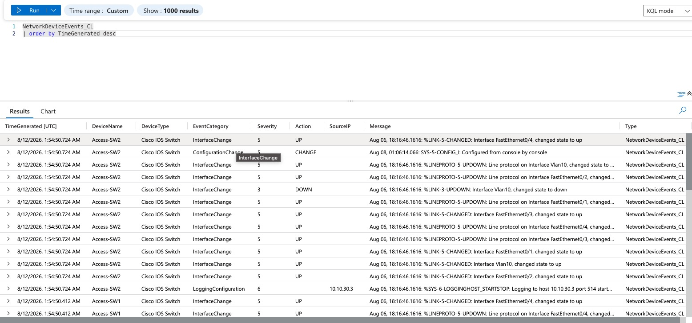
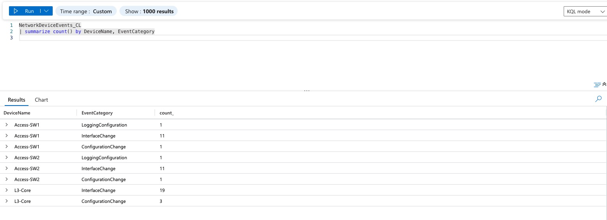
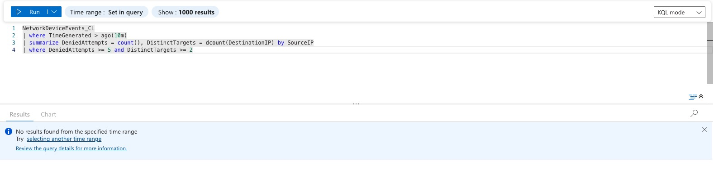

# Phase 3 — Syslog Detection Layer → Ingestion into Microsoft Sentinel

## Project Overview

This phase wires up centralized logging across the network devices, exports that log data
out of Packet Tracer, and ingests it into the same Log Analytics workspace used by the
Azure/Sentinel SOC capstone — completing the "network feeds the SOC" story that ties this
project to that one.

**Architecture note, stated up front:** Packet Tracer is a closed simulation and cannot make
real outbound calls to Azure. This phase is deliberately split into a simulated half (syslog
config and log generation inside Packet Tracer) and a real half (an actual Azure Log
Analytics workspace, DCE, DCR, and custom table in a real tenant), bridged manually by
exporting logs out of Packet Tracer, parsing them, and pushing the result via the Logs
Ingestion API. That bridge step — and being explicit about what's simulated vs. real — is
itself part of the deliverable, not a shortcut to gloss over.

## Syslog & NTP Configuration

Every logging-capable IOS device points at SYS-AAA (`10.10.30.3`), which also runs the
network's NTP service so all devices share a consistent clock for log correlation:

```
logging host 10.10.30.3
logging trap informational
logging on
service timestamps log datetime msec
ntp server 10.10.30.3
```

Applied to: **L3-Core**, **Access-SW1**, **Access-SW2**, **Router0**.

**Access switches required a dedicated management SVI first.** A Layer 2 switch has no IP
identity of its own by default — needed one to originate any traffic, including syslog and
NTP. VLAN 1 was ruled out (excluded from the trunk's allowed-VLAN list per Phase 1's
native-VLAN hardening), so both switches were given a static address in VLAN 10 (MGMT)
instead — the more correct home for switch management traffic anyway:
```
interface vlan 10
 ip address 10.10.10.250 255.255.255.0   ! .251 on Access-SW2
 no shutdown
exit
ip default-gateway 10.10.10.1
```

## What Broke, and Why — Least-Privilege ACLs vs. the Monitoring Pipeline Itself

Locking VLANs down to only their legitimate traffic silently blocked the very telemetry
meant to observe them — a genuinely useful lesson, not just a bug list:

- **`USERS-OUT` blocked syslog (UDP 514) and NTP (UDP 123) to SYS-AAA** — neither port was
  in the original permit list, so both fell into the deny. Fixed with explicit permits
  scoped to SYS-AAA specifically.
- **`USERS-OUT` was also silently blocking MGMT-sourced traffic entirely.** It's applied to
  the trunk ports (Fa0/1, Fa0/2) carrying both VLAN 10 and VLAN 20, but every original rule
  matched only `10.10.20.0/24` — MGMT traffic crossing those same ports fell into the
  implicit deny, contradicting the design's "MGMT unrestricted" intent. Found while
  configuring switch management addressing; fixed with an early unconditional MGMT permit.
- **Router0's management traffic to SYS-AAA is subject to the perimeter ACL**, since Router0
  sits on ASAv0's *outside* interface — its own NTP/syslog requests are "outside traffic"
  by the firewall's model, same as anything else external. Required explicit `OUTSIDE-IN`
  permits scoped to Router0's specific address.

## Confirmed Simulator Limitations (Systematically Diagnosed, Not Assumed)

- **ASAv0 has no syslog capability at all in this Packet Tracer build.** Confirmed via the
  config-mode `?` command listing on the ASA, which shows no `logging` entry whatsoever —
  not rejected syntax, the command family doesn't exist in this image.
- **ASA does not inspect ICMP or UDP by default**, and only `inspect icmp` is available as a
  configurable option in this build's policy-map — `inspect udp` does not exist as a class
  at all. This was isolated by testing ICMP (fixed by `inspect icmp`) against UDP (Router0's
  NTP/syslog, which never worked despite identical ACL permits and confirmed hit counts on
  the outbound leg). Conclusion: **Router0's NTP/syslog round-trip through ASAv0 is a
  confirmed, permanent limitation of this simulator**, not an unresolved configuration gap —
  there is no mechanism available to track UDP return traffic through the firewall boundary.
- **The `log` keyword is rejected on `access-list` lines**, on both ASA and IOS, confirmed
  during Phase 2. Direct consequence for this phase: **ACL deny events never generate
  syslog messages in this simulator, on any device, regardless of ACL or logging
  configuration correctness.** This is the reason no ACL-deny evidence appears anywhere in
  the captured logs below — not a gap in testing, a structural absence of the mechanism.

## Log Export & Parsing

Syslog messages were copied out of SYS-AAA's Services panel into per-device raw log files
(`detection/raw_logs/`) and run through a custom parser (`detection/log_parser.py`) that
normalizes each line into a structured record: timestamp, device, event category, severity,
action, source/destination IP where present, and the original message.

**Two real bugs found and fixed during development, worth documenting since they're
legitimate parsing lessons, not just log format trivia:**

1. **Facility vs. mnemonic field confusion.** Cisco syslog format is
   `%FACILITY-SEVERITY-MNEMONIC`. The categorization logic initially checked keywords
   against the *mnemonic* field, but for `LINK`/`LINEPROTO` and `PORT_SECURITY` messages,
   the identifying keyword actually lives in the *facility* field (e.g.
   `%LINK-3-UPDOWN` → facility=`LINK`, mnemonic=`UPDOWN`; the mnemonic alone tells you
   nothing about what changed). Fixed by checking the correct field per message type.
2. **Substring false-positive on interface state.** The mnemonic `UPDOWN` itself contains
   the substring `"down"` (u-p-d-o-w-n), so a naive `"down" in line.lower()` check matched
   on every interface-change line, including ones reporting `up`. Fixed by reading the
   actual reported state from the last word of the message (`"...changed state to up"` /
   `"...changed state to down"`) instead of substring-searching the whole line.
3. **Duplicate log entries.** Every message in the raw export appears twice consecutively —
   consistent with `show logging` showing identical counts for both Console and Monitor
   logging. The parser collapses consecutive exact duplicates so event counts reflect what
   actually happened, not double-counted artifacts of the export method.
4. **Inconsistent `%` prefix.** Some exported lines (notably `CONFIG_I` events) omit the
   leading `%` entirely. The facility-matching regex was adjusted to treat it as optional.

## Azure Ingestion Pipeline

- **Log Analytics workspace**, dedicated to this project (`ccna-capstone-law`)
- **Custom table**: `NetworkDeviceEvents_CL` — `TimeGenerated`, `DeviceName`, `DeviceType`,
  `EventCategory`, `Severity`, `Action`, `SourceIP`, `DestinationIP`, `Protocol`, `Message`
- **Data Collection Endpoint (DCE)** and **Data Collection Rule (DCR)** targeting the
  custom table, provisioned via Azure CLI
- **Ingestion**: parsed JSON pushed via the `azure-monitor-ingestion` Python SDK
  (`LogsIngestionClient`), authenticated via `AzureCliCredential`

**Setup commands used, in order:**
```bash
az group create --name ccna-capstone-rg --location eastus

az monitor log-analytics workspace create \
  --resource-group ccna-capstone-rg \
  --workspace-name ccna-capstone-law \
  --location eastus

az monitor log-analytics workspace table create \
  --resource-group ccna-capstone-rg \
  --workspace-name ccna-capstone-law \
  --name NetworkDeviceEvents_CL \
  --columns TimeGenerated=datetime DeviceName=string DeviceType=string \
            EventCategory=string Severity=string Action=string \
            SourceIP=string DestinationIP=string Protocol=string Message=string

az monitor data-collection endpoint create \
  --resource-group ccna-capstone-rg \
  --name ccna-capstone-dce \
  --location eastus \
  --public-network-access Enabled

az monitor data-collection rule create \
  --resource-group ccna-capstone-rg \
  --name ccna-capstone-dcr \
  --location eastus \
  --rule-file dcr.json

az role assignment create \
  --assignee <signed-in-user-object-id> \
  --role "Monitoring Metrics Publisher" \
  --scope <DCR resource ID>
```
The DCR's JSON definition (`dcr.json`, referenced above) declares the stream schema
matching the custom table's columns and points its data flow at the Log Analytics
destination — see `detection/dcr.json` for the exact file used.

**Push script** (`detection/ingest_to_azure.py`, not committed with live credentials —
authenticates via `AzureCliCredential`, no secrets stored in the repo):
```python
from azure.identity import AzureCliCredential
from azure.monitor.ingestion import LogsIngestionClient
import json

credential = AzureCliCredential()
client = LogsIngestionClient(endpoint="<INGESTION_ENDPOINT>", credential=credential)

for device_file in [ "L3-Core_Events.json",
    "Access-SW1_Events.json",
    "Access-SW2_Events.json",]:
    with open(f"detection/parsed_output/{device_file}") as f:
        logs = json.load(f)
    client.upload(rule_id="<DCR_ID>", stream_name="Custom-NetworkDeviceEvents_CL", logs=logs)
    print(f"Uploaded {len(logs)} events from {device_file}")
```

**Confirmation query:**
```kql
NetworkDeviceEvents_CL
| order by TimeGenerated desc
```
A populated result here is the end-to-end proof: device → syslog → export → parser → Azure
ingestion → queryable in Log Analytics, the full pipeline the phase set out to build.



**Category breakdown**, confirming the parser's categorization logic worked correctly across
all three devices, not just superficially:
```kql
NetworkDeviceEvents_CL
| summarize count() by DeviceName, EventCategory
```
48 total events ingested: L3-Core (22 — 19 InterfaceChange, 3 ConfigurationChange),
Access-SW1 (13 — 11 InterfaceChange, 1 ConfigurationChange, 1 LoggingConfiguration),
Access-SW2 (13, same breakdown as SW1) — matching the upload script's own printed counts
exactly, confirming no data was lost or miscounted between parsing and ingestion.



## Detection Logic — Designed, Not Live-Triggered

```kql
NetworkDeviceEvents_CL
| where TimeGenerated > ago(10m)
| summarize DeniedAttempts = count(), DistinctTargets = dcount(DestinationIP) by SourceIP
| where DeniedAttempts >= 5 and DistinctTargets >= 2
```

This query is syntactically valid against the deployed table and represents the intended
detection logic (a source generating denied attempts across multiple destination VLANs
within a short window — a probing/lateral-movement pattern, mapped to MITRE ATT&CK
Discovery). **It was not built as a live Sentinel scheduled analytics rule and has not
triggered a real incident.** Two honest reasons: ACL-deny events — the traffic type this
rule is designed to catch — never reach syslog at all in this simulator (see limitations
above), and the captured log volume overall is too sparse to produce a meaningful trigger
regardless. Building and firing the rule against synthetic or backfilled data would
misrepresent what the simulated environment actually produced, so it's documented as
designed intent rather than faked as validated. Run once against the live table for the
record — as expected, it returns no rows: the query's `TimeGenerated > ago(10m)` window
naturally excludes the actual captured events (timestamped Aug 6-8), and even without that
window, no ACL-deny traffic exists in the dataset to match the `DeniedAttempts >= 5`
threshold. Both are consistent with, not contrary to, the limitations already documented
above.



## Validation Evidence

What's captured, per device:

| Device | Syslog reaching SYS-AAA | Event types actually captured |
|---|---|---|
| L3-Core | ✅ Confirmed | Interface state changes, config changes |
| Access-SW1 | ✅ Confirmed | Interface state changes, config changes |
| Access-SW2 | ✅ Confirmed | Interface state changes, config changes |
| ASAv0 | ❌ Not possible (no `logging` command family in this image) | — |
| Router0 | ❌ Not possible (no UDP inspection in this image) | — |

**Azure ingestion: ✅ Confirmed end-to-end.** 48 total events (22 from L3-Core, 13 each from
Access-SW1/SW2) successfully parsed and pushed to the `NetworkDeviceEvents_CL` table via the
Logs Ingestion API, queryable and correctly categorized in Log Analytics.

See `detection/raw_logs/` for the raw exports, `detection/log_parser.py` for the parser,
`detection/parsed_output/` for the normalized JSON, and `azure-ingestion/` for the ingestion
script. Screenshots of syslog arriving on SYS-AAA, the parser running successfully, and the
confirmation/category-breakdown/detection KQL query results: see `screenshots/phase3/`.

## Lessons Learned

**Monitoring infrastructure has to be designed as a first-class traffic requirement, not an
afterthought.** Twice in this phase, correctly-implemented least-privilege ACLs silently
broke the telemetry meant to observe the very network they were securing — a real,
generalizable lesson: security design has to explicitly account for its own supporting
infrastructure, not just the traffic it's protecting.

**Distinguishing "misconfigured" from "platform limitation" is itself real diagnostic work.**
Several findings in this phase (ASA's missing `logging` command family, the absent
`inspect udp` class, the `log`-keyword rejection) required deliberately isolating variables
— testing ICMP against UDP, checking command availability directly via `?` rather than
assuming a rejected command was a typo — before concluding a limitation was real rather than
a mistake still waiting to be found. That discipline is what makes the "designed but not
captured" sections above trustworthy rather than a place where gaps quietly got hidden.

**A parser is only as honest as its handling of edge cases in the real data.** The
substring false-positive on `UPDOWN`, and the facility/mnemonic field mix-up, would have
silently produced plausible-looking but wrong output — a good reminder that log-processing
code needs to be validated against its actual output, not just assumed correct because it
runs without errors.

## Next: Phase 4 preview

Phase 4 automates VLAN/ACL configuration generation from a single YAML source of truth via
Python/Jinja2 — closing the "purely manual CLI" gap, and, unlike this phase, entirely
achievable and testable within Packet Tracer's actual constraints, since it's a config
generation exercise rather than something depending on live network behavior this simulator
can't fully support.
